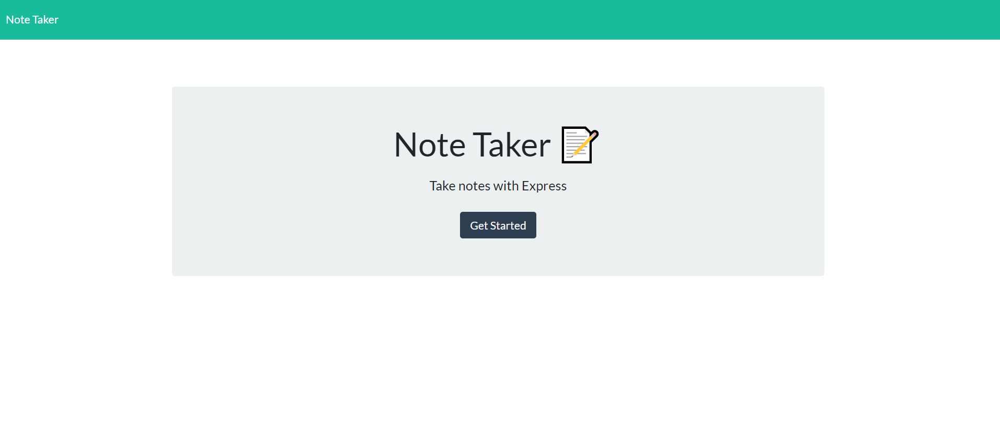
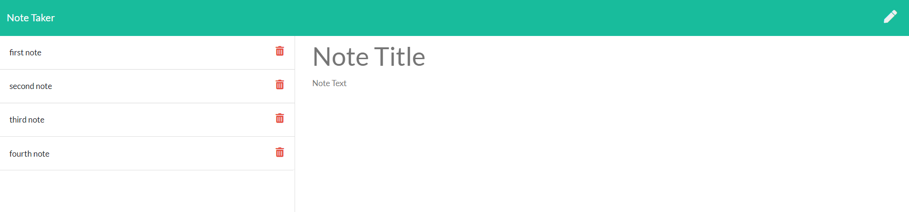
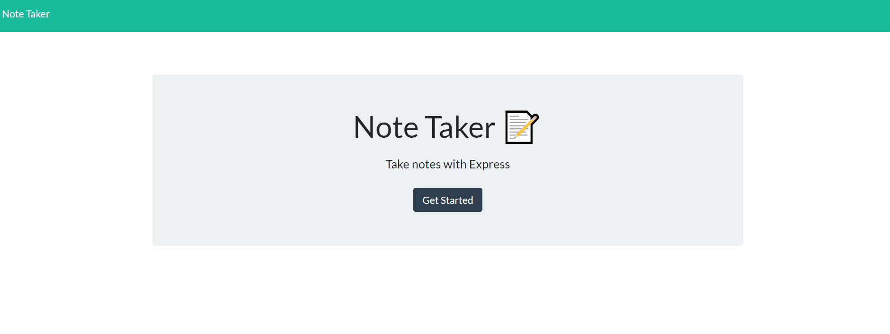

# Note-Taker

## Table of Contents 
  1. [Description](#description) 
  2. [Installation](#installation-guidelines) 
  3. [Preview](#preview) 
  4. [Questions](#questions) 

## Description

A note-taking application designed to write, save, and delete notes.

## Installation Guidelines

This application requires Node.js to be installed on your machine and the npm package Express.

## Preview

Demo

## Questions
Email me: Rachel7113@gmail.com